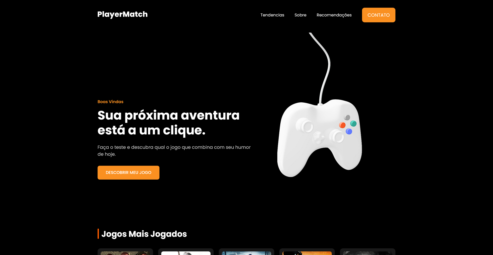

# PlayerMatch

**PlayerMatch** é uma aplicação web interativa construída em **Angular**, que recomenda jogos personalizados para o usuário com base no seu momento e preferências.  
A aplicação consome a **RAWG API** para exibir jogos em alta, mostrando imagem, nome e avaliação de cada título.
Pretendo incluir integraçao com IA para recomendar jogos de acordo com as respostas do usuario.

---

## 📸 Preview



---

## 🚀 Funcionalidades

- ✅ Tela de boas-vindas responsiva
- ✅ Recomendação de jogos em tendência via RAWG API
- ✅ Cards com imagem, nome e nota de avaliação
- ✅ Componentes standalone e estrutura moderna sem AppModule

---

## 🛠️ Tecnologias Utilizadas

- **Angular 18**
- **TypeScript**
- **SCSS**
- **RAWG API**

---

## 📦 Como Executar o Projeto

Clone o repositório:

```bash
git clone https://github.com/WalyssonCavalcante/PlayerMatch.git
```

Acesse a pasta do projeto:

```bash
cd PlayerMatch
```

Instale as dependencias:

```bash
npm install
```

inicie o servidor de desenvolvimento e entao acesse o localhost fornecido:

```bash
ng serve
```
